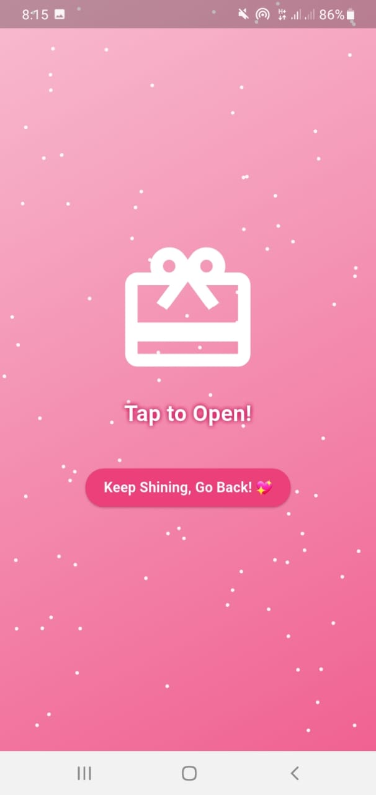
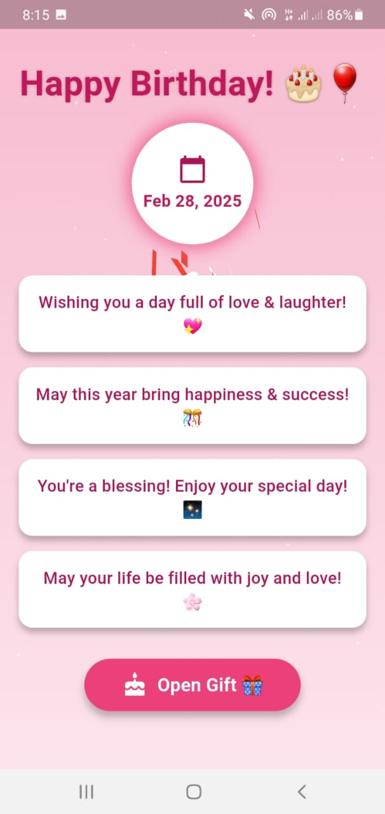
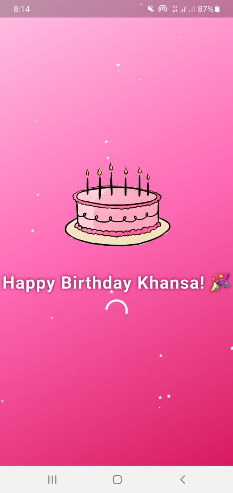
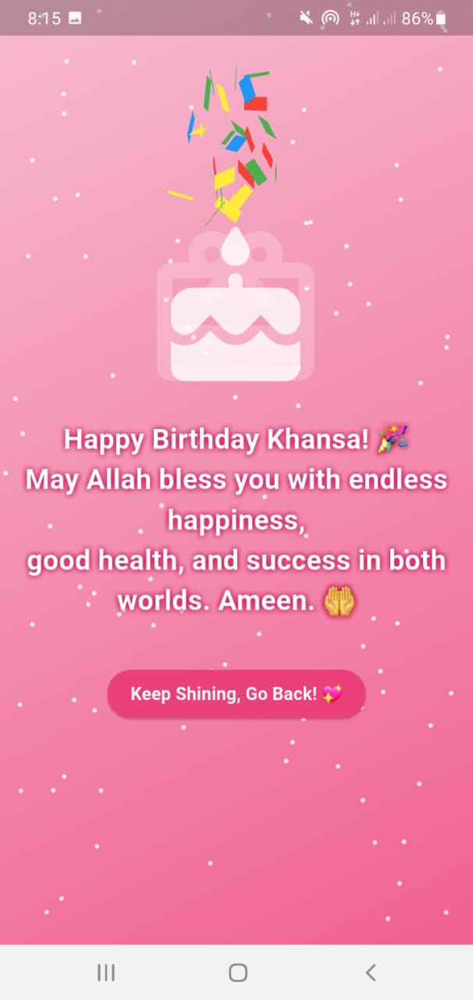
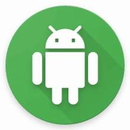

<<<<<<< HEAD
# 🎂 BirthdayWishApp 🎉  

### **Make birthdays extra special with heartfelt wishes and delightful animations!** 🎈🎊  

**BirthdayWishApp** is a beautifully designed Flutter app that lets you send personalized birthday wishes with stunning visuals and animations. 🎁🥳 Whether it's a surprise gift, heartfelt message, or a celebratory animation, this app ensures that every birthday feels memorable!  

---

## 📸 Screenshots  

Take a sneak peek at **BirthdayWishApp**! 📷✨  

### 🎁 Gift Screen  
An interactive surprise gift screen filled with excitement! 🎀  
  

### 🏠 Home Screen  
A welcoming home screen setting the perfect birthday mood! 🎉  
  

### 🎆 Splash Screen  
A visually appealing splash screen to start the celebration! ✨  
  

### 💌 Wish Screen  
A dedicated wish screen to send beautiful birthday messages! ❤️  
  

---

## ✨ Features  

🎈 **Elegant Birthday UI** – A festive and user-friendly interface  
🎊 **Animated Wishes** – Engaging animations for an interactive experience  
🎁 **Surprise Gift Effects** – Send virtual surprises for a special touch  
🌟 **Customizable Themes** – Choose different styles for a unique experience  
📱 **Seamless Navigation** – Smooth transitions and intuitive controls  

---

## 📂 Folder Structure  

This project follows a clean and organized structure:  

```
BirthdayWishApp/
│── assets/                        # App assets (images, gifs, etc.)
│   ├── screenshots/               # App screenshots
│   │   ├── gift_screen.jpeg
│   │   ├── home_screen.jpeg
│   │   ├── splash_screen.jpeg
│   │   ├── wish_screen.jpeg
│   ├── balloons.gif               # Animated balloons 🎈
│   ├── cake.gif                   # Cake animation 🎂
│   ├── gift_box.jpeg              # Gift box 🎁
│   ├── heart.png                  # Heart icon ❤️
│   ├── wallpaper.png              # Background wallpaper 🖼️
|   ├── apk_extractor_icon.jpeg    #app icon🎯
│
│── lib/                           # Main application code
│   ├── gift_screen.dart           # Gift screen UI 🎁
│   ├── home_screen.dart           # Home screen UI 🏠
│   ├── main.dart                  # Main entry point 🚀
│   ├── splash_screen.dart         # Splash screen UI 🎆
│
│── build/                         # Build output (auto-generated)
│── ios/                           # iOS-specific files 🍏
│── android/                       # Android-specific files 🤖
│── linux/                         # Linux-specific files 🐧
│── .idea/                         # IDE-specific settings 🔧
│── .dart_tool/                    # Dart tool configurations 🎯
```

---

## 🚀 Getting Started  

Follow these steps to **install and run BirthdayWishApp**:  

### 1️⃣ Clone the Repository  
```bash
git clone https://github.com/Hifza-Khalid/BirthdayWishApp.git
cd BirthdayWishApp
```

### 2️⃣ Install Dependencies  
```bash
flutter pub get
```

### 3️⃣ Run the App  
```bash
flutter run
```

---

## 🛠️ Tech Stack  

- **Flutter** 🦋 – Cross-platform development framework  
- **Dart** 🎯 – Optimized programming language for Flutter  
- **Android & iOS Support** 📱 – Works smoothly across platforms  

---

## 📧 Contact  

Have any questions or suggestions? Feel free to reach out! 📩  

💻 **Developer:** Hifza Khalid
📧 **Email:** hifzaofpk@gmail.com  

---

## 💡 Tip: Share the App as an APK! 📤  

Want to share the **BirthdayWishApp** with friends and family? 🎂🎊  
You can send it as an **APK file**! Here’s how:  

1️⃣ **Install "APK Extractor Pro"** on your phone.  
2️⃣ **Open the app** and find **BirthdayWishApp**.  
3️⃣ **Extract the APK** and send it via WhatsApp, email, or any platform! 📩  

🛠️ **App Icon:**   

---

🎂 **Celebrate every birthday with joy, surprises, and love!** 🎊🎈  
=======
# birthday

Happy Birthday

## Getting Started

This project is a starting point for a Flutter application.

A few resources to get you started if this is your first Flutter project:

- [Lab: Write your first Flutter app](https://docs.flutter.dev/get-started/codelab)
- [Cookbook: Useful Flutter samples](https://docs.flutter.dev/cookbook)

For help getting started with Flutter development, view the
[online documentation](https://docs.flutter.dev/), which offers tutorials,
samples, guidance on mobile development, and a full API reference.
>>>>>>> 7b4509c (birthday wish app)
